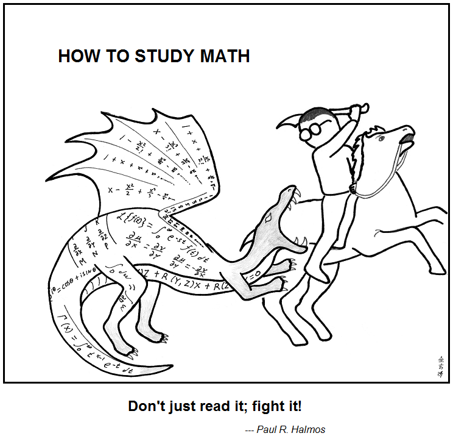

<header>

</header>
     

# MAT281 - 2° Semestre 2019
## Aplicaciones de la Matemática en la Ingeniería

## Contenidos

* [Equipo de trabajo](#et)
* [Horario](#ho)
* [Aspectos generales](#ag)
* [Reglas del juego](#rg)
* [Referencias](#Referencias)

## Equipo de trabajo

**Francisco Alfaro Medina** - Profesor clases teóricas/laboratorio
* Ingeniero Civil Matemático - UTFSM, Chile (2011-2017).
* Magister en Ciencias, Mención Matemáticas - UTFSM, Chile (2017-2019).
* Empresas: Uplanner, Iconstruye, Cencosud.
* Universidades: UTFSM, PUCV.
* Actualmente: Data Science (Cencosud)

## Horario

* **Clases teóricas**: Lunes, 14:00 a 15:30.
* **Clases de laboratorio**: Lunes, 15:40 a 17:10. 
* **Ayudantías**: Viernes, 15:40 a 17:10. 
* **Trabajo individual**: 2-3 horas por semana.

##  Aspectos generales
### Programa del curso

* **Módulo 1** *Introducción*: Planificación del curso, reglas, herramientas, setup, consejos y otros temas introductorios.

* **Módulo 2** *Análisis de datos*: Tipos de datos, obtención de datos, detección de errores, análisis.

* **Módulo 3** *Visualización*: tipos de visualización, librerías más comunes, graficos dinámicos, etc.

* **Módulo 4** *Machine Learning*: Datasets, métricas, algoritmos de  regresión, clasificación y clustering. Resolución de problemas ingenieriles.

El programa de asignatura tiene los siguientes **resultados de aprendizaje**.

1. *Desarrollar competencias básicas en herramientas de programación como Python o R*.
2. *Determinar la complejidad en la manipulación de datos (pequeños-grandes volúmenes de datos)*
3. *Aplicar técnicas y herramientas de visualización de datos para identificar patrones de forma visual o presentar los resultados de una forma clara y concisa.*
4. *Aplicar técnicas estadístico/matemáticas para resolución de problemas ingenieriles*.

Los resultados de aprendizaje se encuentran correlacionados con las necesidades ingenieriles del mundo real. Por ejemplo,
* Mejor utilización de recursos.
* Garantizar calidad y reproducibilidad.
* Detectar malas prácticas e ineficiencias.
* Utilizar las mejores herramientas para el problema.
* Definir métricas para determinar, controlar y mejorar el estado de un sistema.

## Reglas del juego

* **Evaluaciones**: Tareas(T), laboratorios(L) y proyectos(P). Pondereción: $NF = 0.4\ T + 0.4 \ L + 0.2 \ P$.
* **Asistencia**: 85% de asistencia mínima para pasar el curso.

## Referencias

* **Introduction to Statistical Learning**, Gareth James, Daniela Witten, Trevor Hastie and Robert Tibshirani.
* **Elements of Statistical Learning**, Trevor Hastie, Robert Tibshirani and Jerome Friedman.
* **The Hundred-Page Machine Learning Book**, Andriy Burkov.
* **Introduction To Machine Learning With Python**, Andreas C. Müller,sarah Guido.

## Consejos

